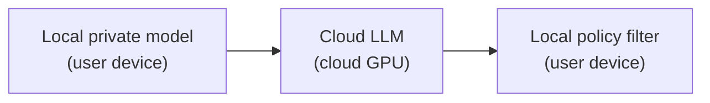
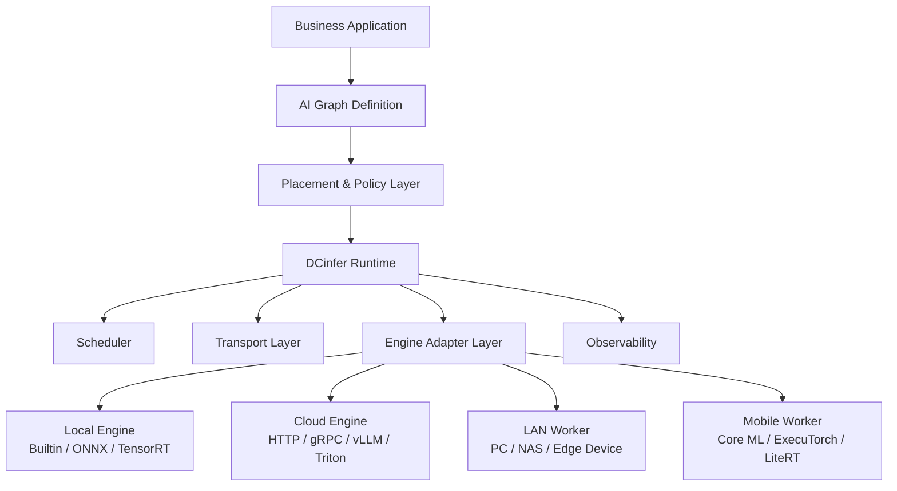
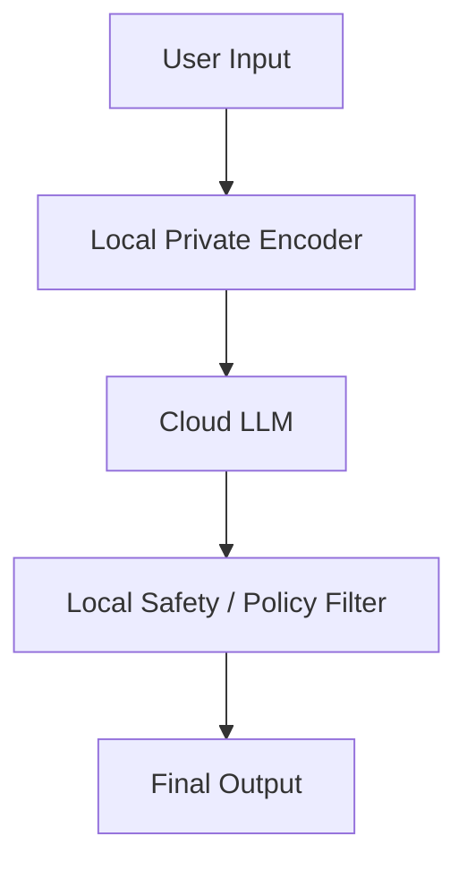
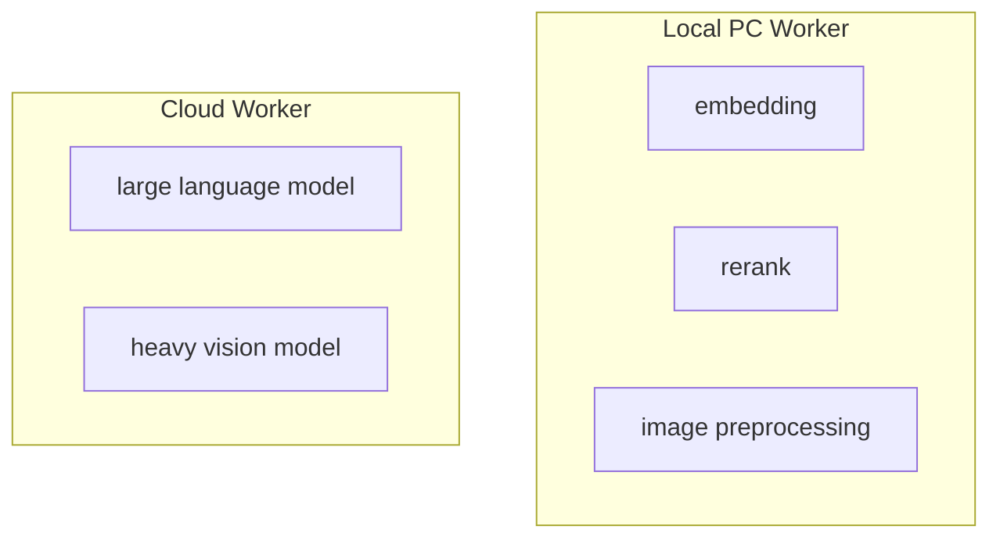
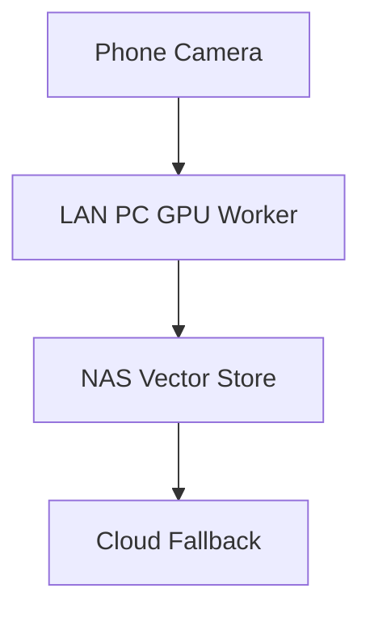
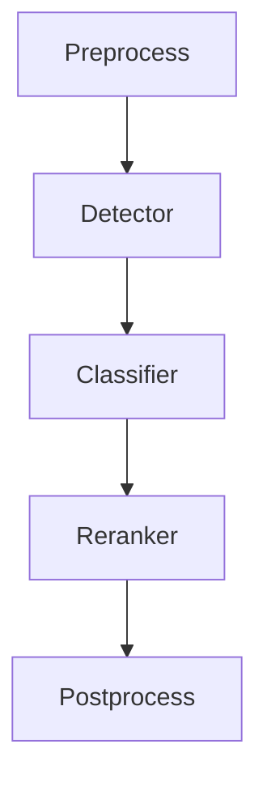

# DCinfer

[](https://en.cppreference.com/w/cpp/20)
[](LICENSE)

*A policy-driven runtime for hybrid AI inference.*  
*面向端云协同 AI 的策略驱动推理运行时。*

DCinfer 是一个 C++20 推理管线编排器，目标是让 AI 应用能够在 **本地、云端、PC、局域网设备以及不同推理引擎** 之间自由放置模型节点，同时把网络、调度、数据传输、引擎生命周期和执行细节隔离在 Runtime 层。

DCinfer 不是推理引擎。
它不试图替代 ONNX Runtime、TensorRT、Core ML、ExecuTorch、vLLM 或其它模型执行后端。

DCinfer 的核心价值是：

> **让开发者自由决定模型在哪里运行，并尽可能不关心底层执行环境的复杂度。**

---

## Why DCinfer?

现代 AI 应用越来越不像“单模型推理”，而更像由多个模型、规则、前后处理、外部服务和私有逻辑组成的推理管线。

一个真实 AI Pipeline 可能包含：

* 用户本地私有模型
* 云端大模型
* PC 端 GPU Worker
* 局域网推理节点
* 企业内网模型服务
* 预处理 / 后处理算子
* 权限、审计、过滤、路由逻辑
* 多种推理引擎和硬件后端

这些能力带来了很高的自由度，但也引入了复杂度：

* 模型应该放在本地还是云端？
* 哪些节点必须保护隐私？
* 哪些节点可以为了延迟迁移到云端？
* 本地设备过热、断网或算力不足时如何回退？
* AI 架构师是否必须理解网络传输、设备发现和张量序列化？
* 业务工程师是否必须关心底层引擎和线程池？

DCinfer 试图解决的问题是：

> **在保证推理执行自由度的前提下，最大程度隔离业务层、AI 架构层、调度层和系统层之间的复杂度。**

## Design Philosophy

### Freedom of Placement

同一个推理图中的不同节点可以被放置在不同执行环境中：

* Local device
* PC client
* Cloud service
* LAN worker
* Private server
* Custom engine backend

开发者不应该被迫把整个 AI 应用固定在某一种部署模式中。



### Policy over Hardcoding

DCinfer 的长期目标不是让开发者手写复杂的调度逻辑，而是通过策略描述意图：AI 架构师描述约束，Runtime 决定执行计划。

### Separation of Concerns

DCinfer 关注不同角色之间的职责隔离：

| 角色     | 关注点                                        | 不应该关心             |
| ------ | ------------------------------------------ | ----------------- |
| 业务开发者  | 调用推理图，获得结果                                 | 网络、线程、模型加载、设备选择   |
| AI 架构师 | 节点、输入输出、隐私约束、质量要求                          | NAT、gRPC、序列化、连接恢复 |
| 平台工程师  | Runtime、Worker、调度、监控                       | 业务逻辑和模型语义         |
| 引擎工程师  | ONNX / TensorRT / Core ML / Custom Backend | 上层业务流程            |

目标是让 AI 架构师专注于模型和管线设计，让网络与系统工程复杂度沉入 Runtime。

## Core Features

### 灵活的图拓扑

DCinfer 不强制推理图为传统 DAG。采用 **节点 + 端口 + Connector** 建模，支持复杂推理管线、成环拓扑，更适合高并发、多分支、多模型推理场景。

### 原生并发执行

数据就绪后自动触发下游节点，计算节点可乱序并发执行。内置 Compute / Operator / System 三层线程池，隔离模型推理、CPU 算子和系统任务。

### Schema 安全的张量系统

编译期定义端口 Schema，运行时校验类型与形状。提供原生 DC::Tensor 与类型擦除 TensorSlot，支持类 NumPy 的链式视图索引。

### 插件式引擎注册

通过 EngineRegistry 统一管理不同后端（Builtin、ONNX Runtime、TensorRT、Core ML 等）的节点创建，同一推理图可逐步适配不同执行后端。

### 零依赖核心

核心库为 static lib，核心模块不依赖第三方库。vcpkg 仅用于后续可选后端和外部引擎集成。

## Architecture

### Conceptual Architecture



## Core Concepts

### Node

Node 是推理图中的基本计算单元。定义输入/输出 Schema 并标记线程池归属（Compute / Operator / System），开发者只需关注"这个节点做什么"，线程调度由 Runtime 接管。

### Connector

节点间的数据路由层。Connector 遵循 **Edge as Node** 语义——业务节点不直连，而是通过 Connector 中转。内置两种路由模式：`Broadcast`（1→N 广播）、`Routing`（1→N 条件分发）。

### InferGraph

推理图容器。负责节点生命周期管理、拓扑连接、输入注入、执行触发与输出收集。

### EngineRegistry

引擎注册中心。通过统一接口管理不同后端的节点创建，注册后即可在图中使用。

### CoroScheduler

协程调度器。数据就绪后自动触发下游节点，支持乱序并发执行，无需开发者手动编排执行顺序。

## Example Use Cases

### Hybrid Local + Cloud Inference



适合：

* 用户私有模型不上传
* 云端提供大模型能力
* 本地执行审计、过滤、偏好控制

### PC Client + Cloud Runtime



适合：

* AI PC 客户端
* 降低云端成本
* 利用用户本地 GPU / NPU
* 根据设备性能动态调整推理分布

### LAN Heterogeneous Inference



适合：

* 私有局域网 AI
* 工业视觉
* 家庭 / 企业边缘推理
* 多设备协作

### Multi-Model Pipeline



适合：

* 多模型串联
* 多分支推理
* 自定义前后处理
* 高并发 pipeline

## Quick Start

### Requirements

| Item                  | Detail              |
| --------------------- | ------------------- |
| C++ Standard          | C++20               |
| CMake                 | >= 3.17             |
| Dependency Manager    | vcpkg (vendored)    |
| External Dependencies | Zero (core library) |

### Build

```bash
cd DCinfer

cmake -B build -S . \
  -DCMAKE_TOOLCHAIN_FILE=external/vcpkg/scripts/buildsystems/vcpkg.cmake

cmake --build build --config Release
```

Windows PowerShell:

```powershell
cd DCinfer

cmake -B build -S . `
  -DCMAKE_TOOLCHAIN_FILE=external/vcpkg/scripts/buildsystems/vcpkg.cmake

cmake --build build --config Release
```

### Run Tests

```bash
ctest --test-dir build -C Release
```

## Roadmap

从单进程本地图运行时出发，逐步演进：

1. **Local Graph Runtime** — 稳定核心 API，完善测试与基准
2. **Local + Remote Placement** — 同一图中节点可显式标记本地/远程执行
3. **Policy-Driven Scheduling** — 声明策略（隐私优先 / 延迟优先 / 成本优先），Runtime 生成执行计划
4. **PC + Cloud Hybrid** — PC 承担本地模型与预处理，云端承担大模型与高吞吐任务
5. **Mobile & LAN Workers** — 手机、NAS、边缘设备与云端组成异构推理环境

---

## License

This project is licensed under the [MIT License](LICENSE).
