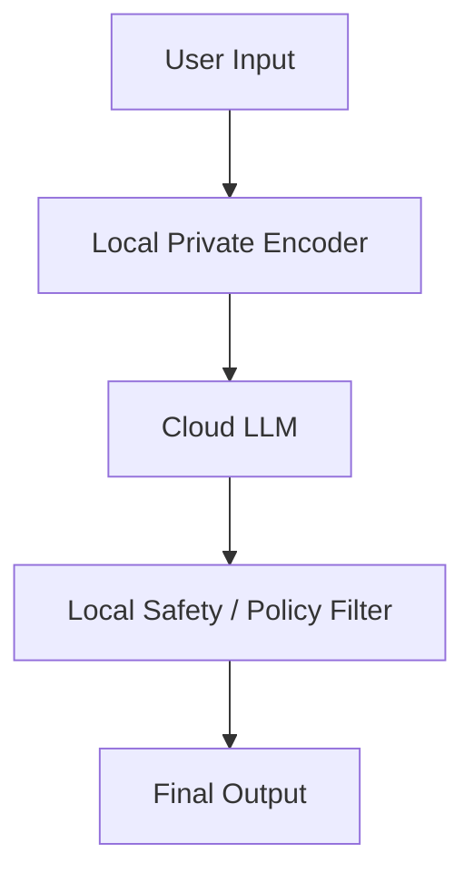
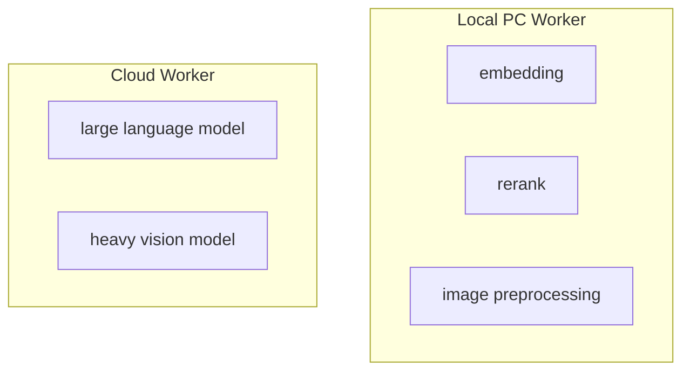
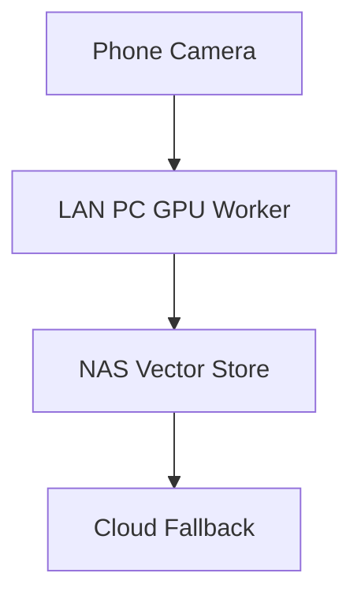
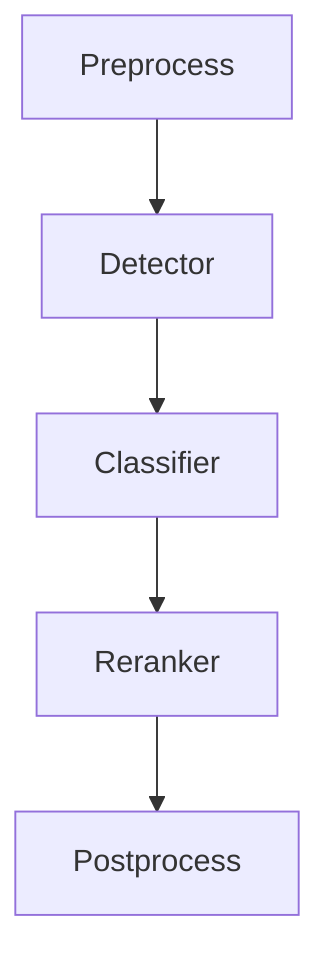

# DCinfer

[](https://en.cppreference.com/w/cpp/20)
[](LICENSE)

*A policy-driven runtime for hybrid AI inference.*  
*面向端云协同 AI 的策略驱动推理运行时。*

DCinfer 是一个 C++20 推理管线编排器，目标是让 AI 应用能够在 **本地、云端、PC、局域网设备以及不同推理引擎** 之间自由放置模型节点，同时把网络、调度、数据传输、引擎生命周期和执行细节隔离在 Runtime 层。

DCinfer 不是推理引擎，而是输出区驱动的循环推理管线。它不试图替代 ONNX Runtime、TensorRT、Core ML 或其它模型执行后端。核心价值是：**让开发者自由决定模型在哪里运行，并尽可能不关心底层执行环境的复杂度。**

---

## 核心功能

### 灵活的图拓扑

传统 DAG 框架将推理管线约束为线性或树形结构——这在多模型、多分支场景下很快会成为瓶颈。DCinfer 采用 **节点 + 端口 + Connector** 的抽象：节点通过类型化端口声明输入输出 Schema，Connector 负责节点间的数据路由。

得益于此模型，你可以轻松构建：

- **多分支管线**：单输出同时驱动多个下游节点并行推理
- **汇聚模式**：多个上游输出合并注入同一节点
- **成环拓扑**：支持反馈回路，用于迭代优化、强化学习或流式场景
- **动态路由**：Connector 支持 `Broadcast`（1→N 广播）和 `Routing`（1→N 条件分发），根据运行时条件决定数据流向

你不必被框架的拓扑假设限制——按问题本身的需求设计推理管线。

### 原生并发执行

DCinfer 采用**数据驱动执行模型**：节点在所有输入就绪后自动触发，下游节点由上游数据到达事件自动唤醒，无需手动编排执行顺序。独立分支间可乱序并发执行，天然利用多核与异构硬件。

内置三层线程池隔离不同类型的负载：

- **Compute Pool**：专用于模型推理（GPU / NPU 密集型），避免推理任务被 CPU 计算抢占
- **Operator Pool**：承担 CPU 预处理、后处理、特征工程等算子
- **System Pool**：处理 I/O、网络传输和系统维护任务

三层隔离确保重计算不会拖慢系统响应，I/O 延迟也不会阻塞推理吞吐。

### Schema 安全的张量系统

类型和形状错误是 ML 管线中最常见的运行时故障。DCinfer 的张量系统允许在图构造阶段就定义端口 Schema——数据类型和形状在图上声明，执行前即可校验。

核心能力：

- **编译期端口类型**：`DC::Tensor` 在编译期捕获类型不匹配，将错误从运行时提前到构建时
- **类型擦除传输**：`TensorSlot` 提供泛型通道，在端点保持类型安全的同时实现中间层零耦合
- **类 NumPy 链式视图索引**：切片、重塑、转置均通过视图实现，不拷贝底层数据
- **零拷贝路径**：同内存空间的节点间张量以引用传递，消除不必要的内存搬运

### 插件式引擎注册

DCinfer 将"节点做什么"与"用什么引擎执行"解耦。`EngineRegistry` 提供统一接口，在运行时注册和发现后端引擎——同一张推理图可以逐步适配不同执行后端。

开箱支持的后端：

| 后端 | 适用场景 |
|------|---------|
| **Builtin** | 纯 C++ 预处理、分词、轻量计算算子 |
| **ONNX Runtime** | 跨平台模型推理，CPU / GPU 硬件加速 |
| **TensorRT** | NVIDIA GPU 深度优化推理 |
| **Core ML** | Apple Silicon 原生加速 |
| **Custom** | 注册自有引擎，接入专有或研究模型 |

节点通过引擎名称引用后端——替换引擎无需修改管线结构。

### 零依赖核心

DCinfer 核心库为静态库，**零外部依赖**。不需要 Boost、Protobuf、gRPC——仅需 C++20 和标准库。vcpkg 只用于可选的后端集成（ONNX Runtime、TensorRT 等），选择使用才链接，不使用时零开销。

这意味着：

- **快速编译**——无需构建庞大的依赖树
- **轻松集成**——一个 `add_subdirectory` 即可加入任何 CMake 项目
- **最小二进制体积**——只为实际使用的功能付费

---

## Example Use Cases

### Hybrid Local + Cloud Inference



适合：

* 用户私有模型不上传
* 云端提供大模型能力
* 本地执行审计、过滤、偏好控制

### PC Client + Cloud Runtime



适合：

* AI PC 客户端
* 降低云端成本
* 利用用户本地 GPU / NPU
* 根据设备性能动态调整推理分布

### LAN Heterogeneous Inference



适合：

* 私有局域网 AI
* 工业视觉
* 家庭 / 企业边缘推理
* 多设备协作

### Multi-Model Pipeline



适合：

* 多模型串联
* 多分支推理
* 自定义前后处理
* 高并发 pipeline

---

## Quick Start

### Requirements

| Item                  | Detail              |
| --------------------- | ------------------- |
| C++ 标准              | C++20               |
| CMake                 | >= 3.17             |
| 依赖管理               | vcpkg (vendored)    |
| 第三方依赖             | 无 (core library)   |

### Build

```bash
cd DCinfer

cmake -B build -S . \
  -DCMAKE_TOOLCHAIN_FILE=external/vcpkg/scripts/buildsystems/vcpkg.cmake

cmake --build build --config Release
```

### Run Tests

```bash
ctest --test-dir build -C Release
```

---

## License

This project is licensed under the [MIT License](LICENSE).
